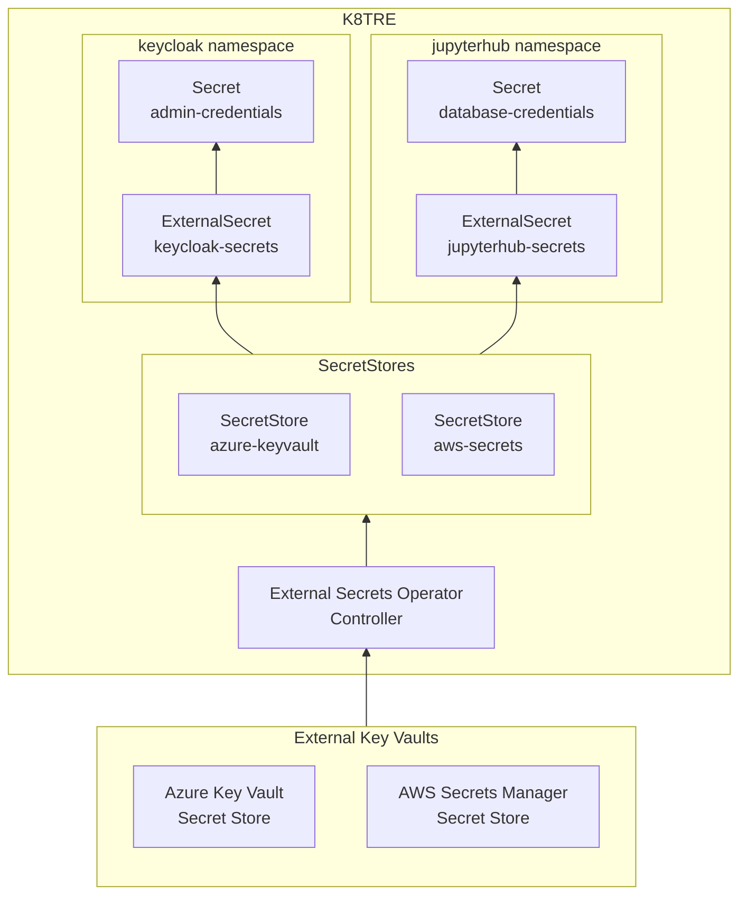

# Agnostics

K8TRE implements a base application plane that serves to abstract away some of the vendor-specific nuances of K8S.
This plane also contains several common components that are required by the rest of the deployment such as applications for certificate and secret management, managing external DNS entries, etc.

Some of these components are described briefly here.
Links are also provided for more comprehensive documentation.

## Secrets

K8TRE uses [External Secrets Operator (ESO)](https://external-secrets.io/) to synchronize secrets from external APIs into Kubernetes.
ESO integrates with a large number of secret stores and keyvaults such as [Azure Key Vault](https://external-secrets.io/latest/provider/azure-key-vault/), [AWS Secrets Manager](https://external-secrets.io/latest/provider/aws-secrets-manager/) and more.
The reference implementation currently provides a simple, centralised [Kubernetes __secret store__](https://external-secrets.io/latest/provider/kubernetes/).

K8TRE deployments may choose to implement an alternative key vault solution and declare the equivalent secret store that ESO will use to synchronise to.
Applications can then access the secrets in the _secret store_ by declaring `ExternalSecret` custom resources as part of their manifests.

ESO will manage the entire lifecycle of secrets from fetching them from the secret store to deploying it into the correct namespace(s) where they are needed.

## Storage

Creating an abstraction layer for storage is particularly important due to the multiple [storage classes](https://kubernetes.io/docs/concepts/storage/storage-classes/) available within any one K8S provider as well as across multiple providers.
These storage classes provide different capabilities.
At the most basic level, disk-based storage classes (eg. hostpath-storage for baremetal clusters, default storage class for Azure Kubernetes Service) do not offer ReadWriteMany capability that applications may need.
This requires storage classes that leverage vendor-specific _Container Storage Interface (CSI)_ drivers such as [Azure Files CSI](https://learn.microsoft.com/en-us/azure/aks/azure-files-csi).
Moreover, default mount options may vary between vendors and will require standardisation.

K8TRE solves this by providing a set of storage classes that application developers can use in their manifests without having to concern themselves with the underlying technology backing the storage class.

## Ingress

### Internal Cilium Gateway

K8TRE supports and manages ingress through the implementation of a k8s cluster [Gateway](https://gateway-api.sigs.k8s.io/api-types/gateway/) instance (cilium-gateway) based on Cilium's Gateway API controller to support application traffic routing.
By default a Gateway instance is deployed along with a k8s Service of type loadbalancer (cilium-gateway-internal-gateway).
Dependent on the target infrastructure, this Service should be associated with a private load balancer within the underlying private network the K8TRE cluster resides.
For the K8TRE MVP on Azure, the Gateway Service is annotated to provision the internal load balancer on the K8TRE cluster's private VNet.

!!! note
    For K8TRE deployments that require a public ingress, additional infrastructure is required to route traffic from a public endpoint to a cluster's internal load balancer.

### Public Gateway

K8TRE's internal gateway can manage application traffic from within the target infrastructure's private network.
However, the internal gateway and associated private load balancer do not allow for traffic routing from the public internet.
Where a TRE operator must support restricted public network access, a public load balancer (reverse proxy) should be provisioned within the underlying infrastructure that can route traffic to the internal/private Gateway load balancer.
For example, the K8TRE Azure infrastructure recipe project implements Azure Application Gateway (v2) that provides a public IP address, routing rules and backend pool where the K8TRE gateway internal load balancer is configured as a backend pool target where relevant traffic is forwarded.
For more information on the implementation of this, see the K8TRE-Azure infrastructure project [Public Gateway documentation](https://k8tre.github.io/k8tre-azure/public_gateway/).

### NGINX Controller

K8TRE service ingress should where possible establish HTTP routes that utilise the K8TRE internal gateway for host/path-based routing and adopt the Gateway API approach.
However, it remains possible for services to define an [Ingress](https://kubernetes.io/docs/concepts/services-networking/ingress/) managed by an [NGINX Ingress Controller](https://kubernetes.github.io/ingress-nginx/) in K8TRE where required.
As support for Gateway API grows and Ingress support is frozen, K8TRE's ingress support will reflect this transition.

## DNS

Services within K8TRE are discoverable as normal through CoreDNS with the usual format of `<service-name>.<namespace>.svc.cluster.local`.
However, where services need to be exposed to external clients, an external DNS entry is required.
There are a large number of DNS solutions such as [Azure DNS](https://learn.microsoft.com/en-us/azure/dns/public-dns-overview), [Azure Private DNS](https://learn.microsoft.com/en-us/azure/dns/private-dns-overview), [Amazon Route 53](https://aws.amazon.com/route53/), etc.

K8TRE implements automatic DNS management through [ExternalDNS](https://kubernetes-sigs.github.io/external-dns/), which watches Kubernetes resources (Services, HTTPRoutes, GRPCRoutes) and automatically creates, updates, and deletes DNS entries.
For cloud deployments like Azure or AWS, ExternalDNS integrates directly with provider-specific DNS services such as Azure Private DNS or AWS Route 53.

### K3s DNS

K3s deployments present a unique challenge: there is no cloud-native DNS service available.
To address this, K8TRE implements a dual-layer DNS architecture specifically for K3s that combines ExternalDNS with a custom DNS solution.

**Why kare-dns is needed for K3s:**

Unlike cloud Kubernetes platforms that provide managed DNS services, K3s clusters lack an integrated DNS backend for external domain management.
While K3s includes CoreDNS for internal cluster DNS, it cannot serve as an authoritative nameserver for environment-specific domains (e.g., `dev.<domain>`, `stg.<domain>`) that applications need to be accessible from outside the cluster.

K8TRE solves this by deploying **kare-dns**, a dedicated CoreDNS instance that acts as the authoritative DNS server for the environment domain.
ExternalDNS is configured to use the CoreDNS provider, writing DNS records directly to kare-dns's backend. The cluster's main CoreDNS is then automatically patched to forward all queries for the environment domain to kare-dns.

This architecture provides K3s deployments with the same automatic DNS management capabilities available in cloud environments, without requiring external DNS infrastructure or manual DNS record management.

For more information on ExternalDNS configuration and supported providers, see the [ExternalDNS documentation](https://kubernetes-sigs.github.io/external-dns/).
