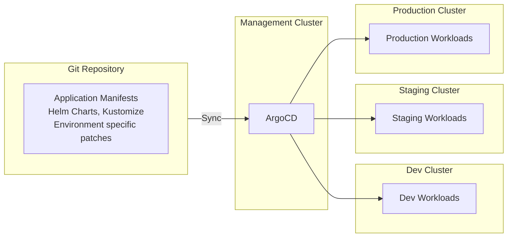
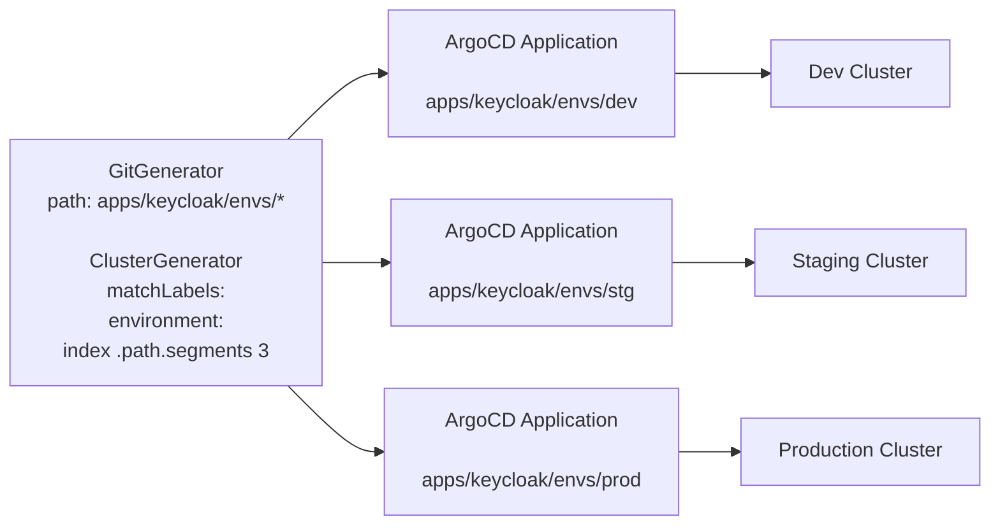

# GitOps using ArgoCD

K8TRE reference implementation uses [ArgoCD](https://argoproj.github.io/cd/) to deploy and manage applications.
Argo CD is a declarative, GitOps continuous delivery tool for Kubernetes.

The reference implementation uses the ArgoCD [_App of Apps_](https://argo-cd.readthedocs.io/en/latest/operator-manual/cluster-bootstrapping/#app-of-apps-pattern) pattern and recommends the use of a separate management cluster for ArgoCD and development, staging and production clusters for applications.



!!! tip "Single cluster setup"
    For local testing and development purposes, it is possible to deploy all the applications for any particular environment into the same cluster that ArgoCD is deployed to.
    This is described in the [development documentation](../development/k3s-dev.md).
    This is not recommended for production deployments.

## Directory Structure

All application manifests for the core components of the reference implementation are stored in the [K8TRE Github repository](https://github.com/umccr/k8tre).

The directory structure of the core repository is described below.
_Information has been truncated to represent the common patterns._

```
├── agnostics
│   ├── cert-manager
│   ├── cnpg
│   │   ├── base        # Base manifests
│   │   └── envs        # Environment specific manifests
│   │       ├── dev
│   │       ├── stg
│   │       └── prod
│   ├── externaldns      # Not all K8S vendors may be targeted
│   │   └── azure
│   ├── external-secrets # Provides abstraction over several secret stores
│   ├── metallb          # Cloud K8S distros provide their own loadbalancers
│   │   └── k3s
│   ├── nginx            # Requires vendor-specific annotations
│   │   ├── azure
│   │   └── k3s
│   ├── secret-store     # Secret store that other applications can use
│   │   └── kubernetes
│   └── storage-class    # K8TRE-specific storage classes
│       ├── aws
│       ├── azure
│       └── k3s
├── app_of_apps          # Main App of Apps manifests (one or more)
├── apps                 # Main folder for applications
│   ├── jupyterhub
│   │   ├── base
│   │   └── envs
│   │       ├── dev
│   │       ├── stg
│   │       └── prod
│   └── keycloak         # Identity management solution for K8TRE
├── appsets              # Argocd Appsets targeting multiple environments
│   ├── agnostics
│   ├── identity
│   └── workspaces
├── ci                   # Scripts for CI and bootstrapping
├── docs
```

## Multi-cluster deployment with Appsets

K8TRE implementation follows a multi-cluster deployment pattern and supports development, staging and production clusters out-of-the-box.
However, K8TRE deployments can choose to deploy only the manifests in one (or more) of the target clusters.

K8TRE uses the ArgoCD [ApplicationSet controller](https://argo-cd.readthedocs.io/en/latest/operator-manual/applicationset/) to manage the deployment of all applications.
The applicationset manifests can be found in the [`appsets/`](https://github.com/umccr/k8tre/tree/main/appsets) directory.

Most appsets in K8TRE use the [matrix generator](https://argo-cd.readthedocs.io/en/stable/operator-manual/applicationset/Generators-Matrix/) combining [git](https://argo-cd.readthedocs.io/en/stable/operator-manual/applicationset/Generators-Git/#git-generator-directories) and [cluster](https://argo-cd.readthedocs.io/en/stable/operator-manual/applicationset/Generators-Cluster/) generators.

The Git Directory generator uses the directory structure to determine the correct manifests for the different environments (dev, stg, prod) using path templates (eg. `apps/keycloak/envs/*` would create 3 ArgoCD Applications using mainfests in `apps/keycloak/envs/dev`, `apps/keycloak/envs/stg` and `apps/keycloak/envs/prod`  )



In the example above, ArgoCD uses the value of the cluster label `environment` and the 4th part of the application path (for `apps/keycloak/envs/dev` this would be `dev`) to deploy the manifests in the `dev` folder to the development cluster.

!!! warning "Clusters must have `environment` label set up"

    As a minimum clusters should have the `environment` label set to one of _dev_, _stg_ or _prod_ to match the directory structure.
    Without this label, no application will deploy to that cluster.
    Additional labels may be required. See below.

### Vendor-specific applications

Other appsets use this `environment` label in combination with other labels to target specific applications to the correct clusters.

For instance, the `vendor` label can be one of _azure_, _aws (not implemented yet)_ or _k3s_.

### Skipping applications

Some clusters may not want to have certain applications deployed to them.
For instance, _metallb_ must not be deployed to AKS.
This can be achieved by setting the `skip-metallb` label to `true` on the cluster and using the following in the cluster generator section of the applicationset manifest.

```yaml
...
- clusters:
    selector:
    matchLabels:
        environment: "\{\{index .path.segments 4\}\}"
        vendor: "\{\{index .path.segments 2\}\}"
    matchExpressions:
        - key: skip-metallb
        operator: NotIn
        values: ["true"]
...
```

!!! warning "Documentation of labels here is incomplete"
    Complete list of labels and possible values are not documented here yet.
    Please review the manifests in the `appsets` directory and the corresponding app directory
    structure.

## Sync Waves and App Dependencies

Often certain applications need to be deployed first before other applications can be deployed.
For instance, the agnostics application plane must be deployed before the apps.

K8TRE uses [ArgoCD sync waves](https://argo-cd.readthedocs.io/en/stable/user-guide/sync-waves/) to achieve this.
